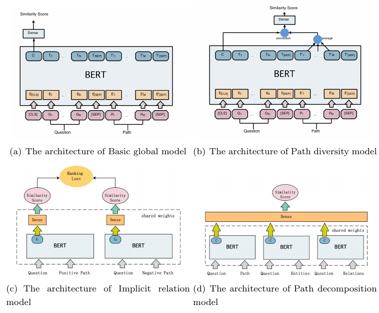

# Natural Language Question Answering over KG with Multi-focus Fusion Model
## 工作流程


## 运行依赖
* TensorFlow 1.15.2 
* keras==2.2.4
* keras_bert==0.84.0
* elasticsearch
* py2neo


## 文件结构&运行方式
* 运行代码需修改Bert等相关文件的路径
* 论文中结果对应的模型参数文件可从[该处](https://drive.google.com/drive/folders/1LPGsIVNDUXU32ofARhjEQoGbDiyH4GUZ?usp=sharing)下载


### Topic Entity Recognition

##### Sequence Labeling
* ckpt保存模型参数的文件夹
训练好的模型参数可以从xxxx下载
* ckpt_result保存预测结果的文件夹
* data 数据文件夹
* 训练
```bash
python ner-train.py
```
* 预测
```bash
python ner-predict.py
```


##### Entity Linking
###### Character Matching


* ckpt_result 输入文件（序列标记的结果）所在文件夹
* test_linking_right  保存结果的文件夹
* test_linking_right_finall  保存结果的文件夹（带评估）
* 该过程使用到了ES索引，构建方式参考build_es.txt
* 执行
``` bash
python matching.py
```
###### Entity Disambiguation
* ckpt_result  上一步骤（Character Matching）的输出，改过程的输入文件
* ckpt_reduce_avg 保存模型参数的文件夹
* ckpt_reduce_avg_result 保存结果的文件夹
* ckpt_reduce_avg_result_finall 保存结果的文件夹（带评估）
* data 文件夹中包含了所需的数据及训练数据的生成代码
* 执行（训练&预测）
``` bash
python reduce_avg_n.py
```

### Candidate Path Ranking

##### Candidate Generation & Similarity Computation

路径生成与相似度计算是交替进行的
* 需要Neo4j提供KG查询服务，构建方式参考build_neo4j.txt
###### Basic global model
* ckpt 保存模型参数的文件夹
* data 保存结果的文件夹
* 训练
```bash
python train_f1.py
```
* 预测(entity linking)
```bash
python predict_f1.py
```
* 预测(path linking)
```bash
pythonget_byES_f1.py
```


###### Path diversity model


###### Implicit relation model


###### Path decomposition model


 



##### Fusion
* data 上一过程得到的5个结果（包含ok_result.txt和pred_result.txt）


* getfinallanswer.py 生成融合结果的代码
* evaluate.py 对结果求precision、recall、F1值
* finall_top3/finallanswer.txt 结果文件，最终选出的查询路径
* finall_top3/finallanswer_answer.txt 根据查询路径获得的答案
* 执行
``` bash
python getfinallanswer.py
```


